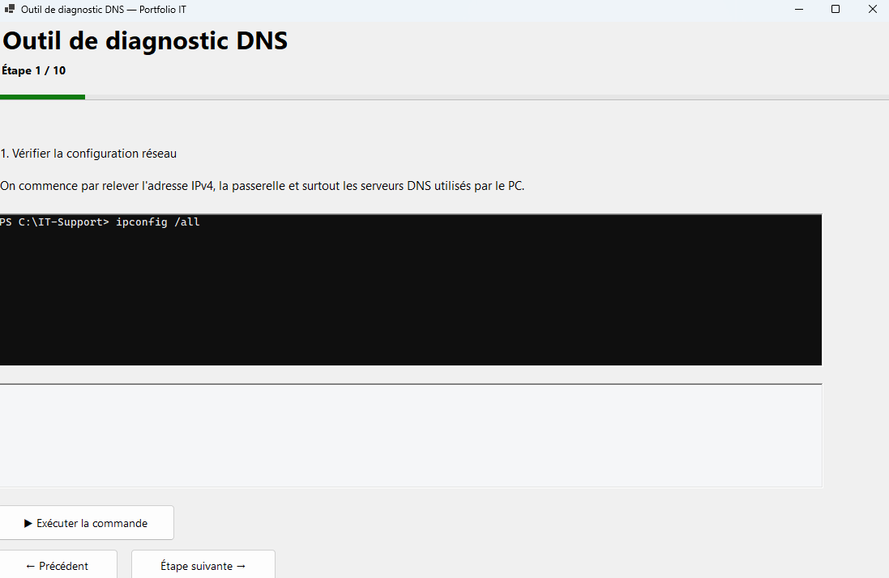
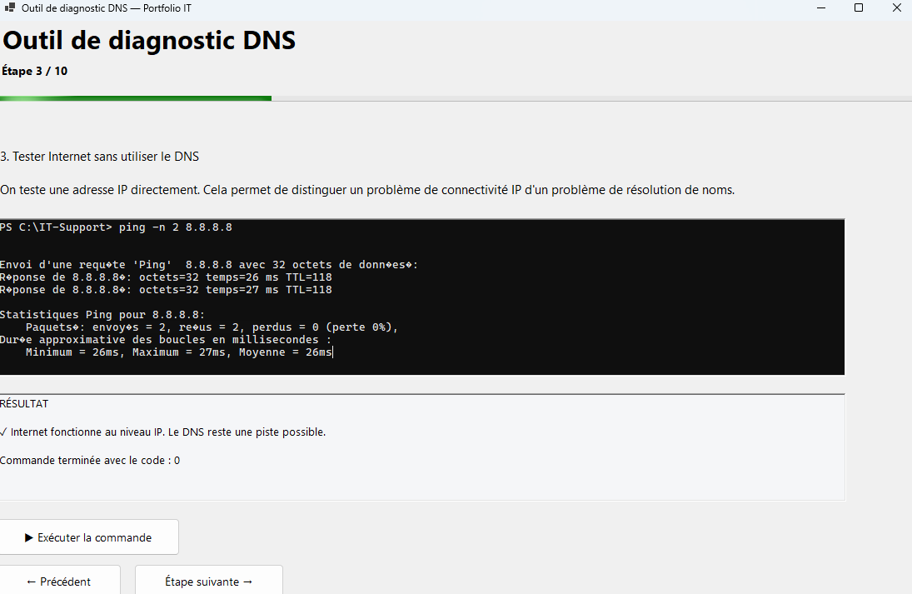
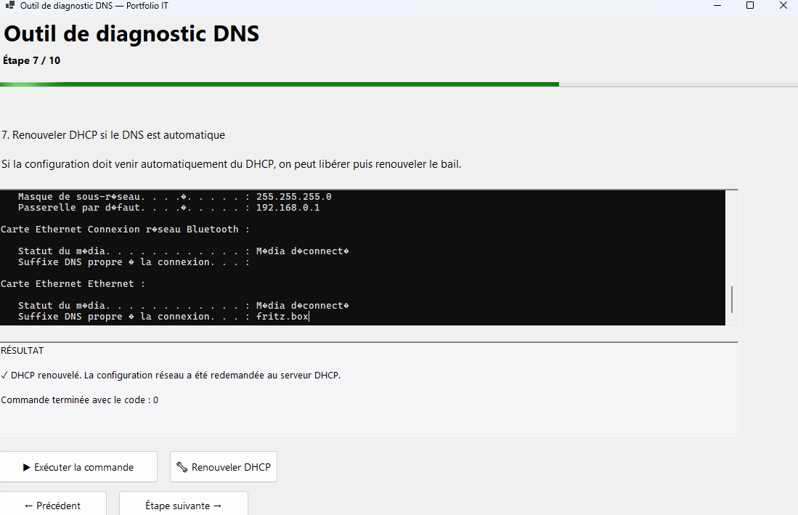

# 🛠️ Outil de diagnostic DNS

## 📌 Présentation

**Outil de diagnostic DNS** est un petit logiciel Windows développé dans le cadre de mon apprentissage du support informatique.

L'objectif du projet est de guider un technicien à travers une procédure structurée de diagnostic d'un problème DNS, tout en affichant directement les commandes utilisées et leurs résultats.

---

## 🎯 Objectifs du projet

Ce projet me permet de mettre en pratique mes connaissances en :

* dépannage réseau ;
* DNS ;
* DHCP ;
* TCP/IP ;
* PowerShell ;
* outils de diagnostic Windows ;
* automatisation de procédures de support informatique.

L'objectif est surtout de comprendre **pourquoi** une commande est utilisée et comment interpréter son résultat.

---

## 🔎 Procédure de diagnostic

L'application guide l'utilisateur à travers plusieurs étapes :

### 1. Vérification de la configuration réseau

```powershell
ipconfig /all
```

Permet de vérifier notamment l'adresse IP, la passerelle et les serveurs DNS utilisés par le PC.

### 2. Test de la passerelle

```powershell
ping <passerelle>
```

Permet de vérifier la communication avec la passerelle du réseau local.

### 3. Test de connectivité IP

```powershell
ping 8.8.8.8
```

Permet de tester la connectivité IP sans dépendre de la résolution DNS.

### 4. Test de résolution DNS

```powershell
nslookup google.com
```

Permet de vérifier si le PC arrive à résoudre un nom de domaine.

### 5. Test du serveur DNS

L'application permet de tester directement le serveur DNS utilisé par l'environnement.

### 6. Renouvellement DHCP

```powershell
ipconfig /release
ipconfig /renew
```

Permet de demander une nouvelle configuration réseau au serveur DHCP lorsque la configuration est obtenue automatiquement.

### 7. Vidage du cache DNS

```powershell
ipconfig /flushdns
```

Permet de vider le cache DNS local avant d'effectuer un nouveau test.

### 8. Nouveau diagnostic

```powershell
nslookup google.com
ping google.com
```

Les tests sont répétés afin de vérifier si le problème a été résolu.

---

## 🖥️ Fonctionnalités

* Affichage des commandes directement dans l'application
* Affichage des résultats retournés par Windows
* Diagnostic étape par étape
* Explication de chaque procédure
* Tests DNS
* Tests réseau
* Renouvellement DHCP
* Vidage du cache DNS
* Vérification du port DNS 53

---

## 🧰 Technologies utilisées

* **C#**
* **.NET 8**
* **Windows Forms**
* **PowerShell**
* **Outils réseau Windows**

---

## 📸 Captures d'écran

### Écran principal



### Diagnostic



### Réparation



---

## 📚 Contexte

Projet personnel réalisé dans le cadre de mon apprentissage du support informatique.

Le projet est amené à évoluer au fur et à mesure de l'apprentissage de nouvelles commandes, procédures et technologies.

---

## 🚀 Évolutions prévues

* Ajouter de nouvelles procédures de dépannage réseau
* Ajouter progressivement des outils PowerShell
* Ajouter d'autres diagnostics Windows
* Améliorer les rapports de diagnostic
* Ajouter de nouvelles procédures étudiées pendant ma formation
